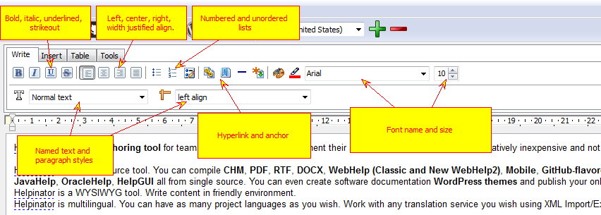
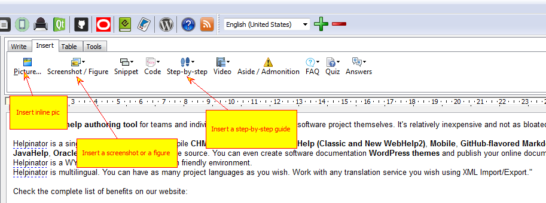
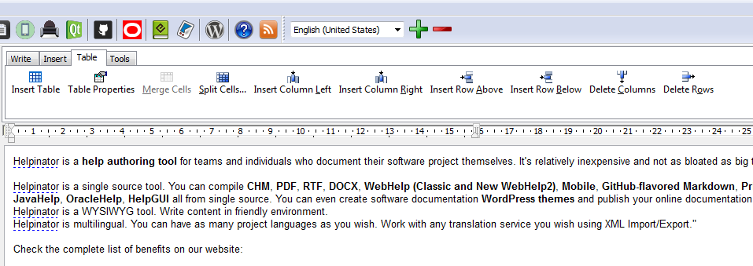
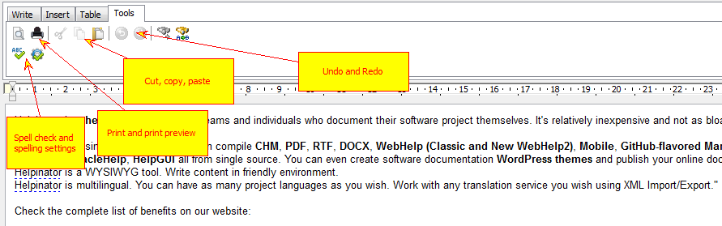

=======================
Tabbed Toolbar Editor
=======================

Classic editor toolbar is too cluttered and overloaded so we introduced a little bit improved tabbed toolbar that has similar functions, divided into categories. It has 4 tabs: "Write", "Insert", "Table" and "Tools".

****

**"Write"** tab has all basic writing functions like fonts, lists and etc.

**"Insert"** tab allows to insert dedicated content pieces of Helpinator - Screenshots, text snippets, code snippets, step-by-step guides, videos, admonitions, faqs and quizzes.

**"Table" **allows to insert and manipulate tables.

**"Tools"** tab contains text processing tools like copy-paste, spellchecker and etc.

"Write" Tab

"Insert" tab

"Table" tab

"Tools" tab

