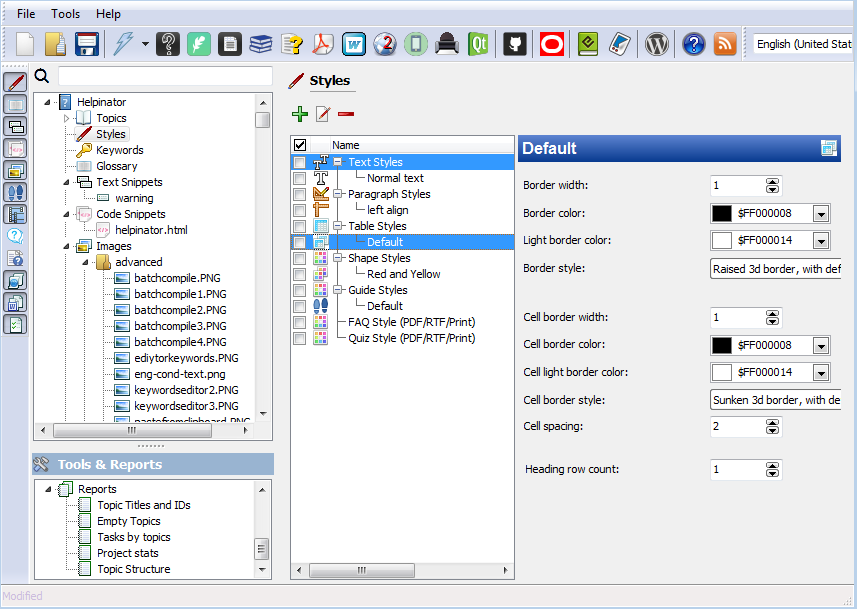

==============
Table Styles
==============

Table styles allow you to keep the same table formatting in all topics.

Table Styles

To use table style you can either select it in the "Insert table" dialog  or from "Cell properties" dialog of WYSIWYG topic editor.

