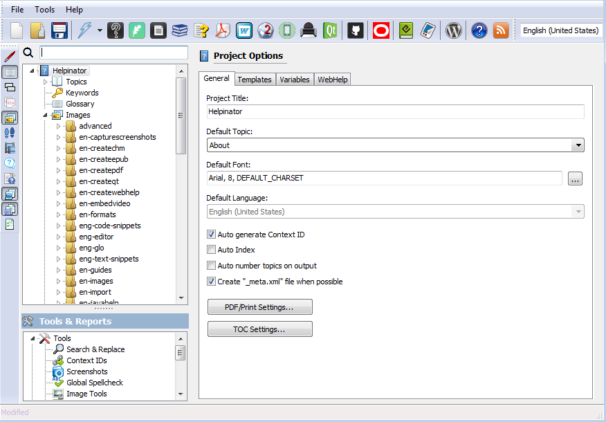
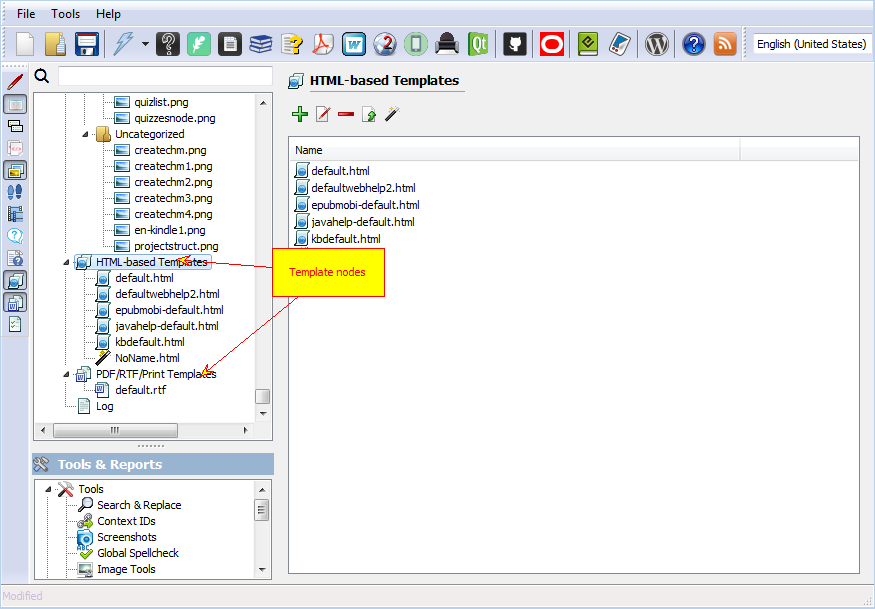

===========
Templates
===========

Helpinator has template engine that uses layout templates for all supported formats when producing help files and documentation. Generally layout templates are divided into two groups:

1. HTML-based templates for producing CHM help files, WebHelp, QtHelp, JavaHelp and EPUB/MOBI.
2. RTF templates for producing RTF, PDF and printed manuals.

Helpinator comes with several predefined templates that you can use in your projects.

Templates are stored inside the project, so you need to add them first to allow Helpinator to use them.

Project templates

Template nodes in the project tree view

