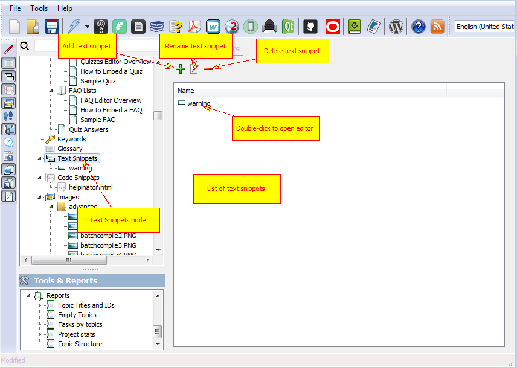
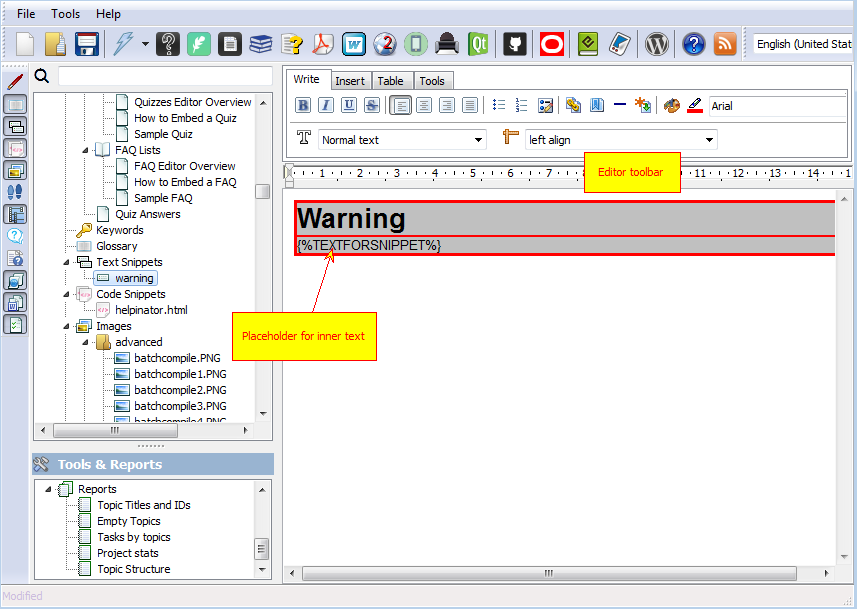

===============
Text Snippets
===============

Text snippets are named reusable blocks of formatted text that you can create once and use in many topics. **Note** that since version 3.19 Helpinator has dedicated content piece called "Aside" and you no longer are forced to use text snippets to create asides.

The picture below shows how to manage text snippets.

Manage Text Snippets

There are two types of text snippets:

1. Simple pieces of formatted text
2. Parameterized snippets, that contain special placeholder TEXTFORSNIPPET which Helpinator replaces with text from the topic.

Here's an example of the second type text snippet:

Edit text snippet

