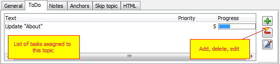
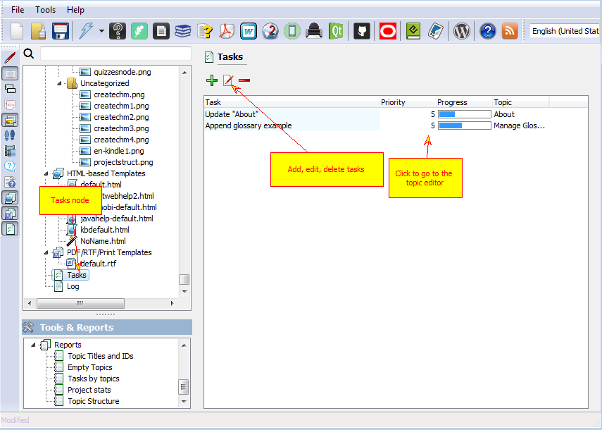
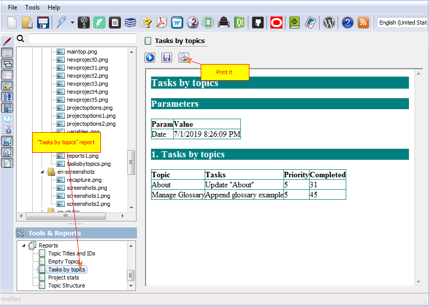

===========
ToDo List
===========

Helpinator allows you to create and manage to-do lists - both for individual topics and the project as a whole. Using this little feature you are able to:

1. Control your tech writers. Of course, this is not a full-featured project planner app with team features, but good enough for small teams and interacting with contractors.
2. Keep your global to-do list free from small tasks associated with this project.
3. Go to the place where a task should be accomplished, without wasting time on finding it.
4. Never forget to to something on your project.

There are two places to work with tasks:

1. "ToDo" tab at the bottom of the topic editor. This tab allows to add/manage tasks assigned to this topic.

Topic todos

2. Global project to-do list with all tasks from all topics and the project itself.

Global Tasks

To add a task for the project itself, not a topic, click "Add" in this global list.

There's also a way to get printed version of your tasks list. Locate "Tasks by topics" report under "Reports" node and run it.

"Tasks by Topics" report

