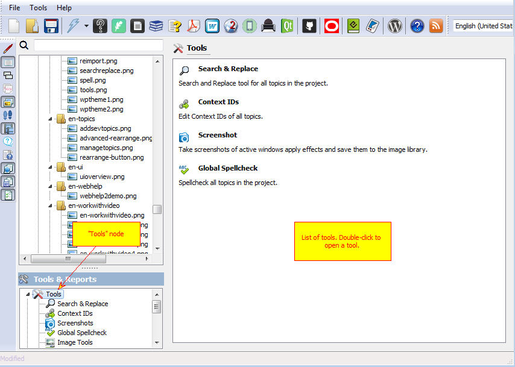

=======
Tools
=======

Helpinator has several built-in accompanying tools to make your help authoring process less frustrating. All of them are under "Tools" node of the project tree view.

Tools

Currently Helpinator has the following tools:

1. **Search and Replace**. Allows you to find and replace text string in all topics of your project.
2. **Context IDs**. Allows to edit all topic Context IDs in one place.
3. **Screenshots**. Allows to take screenshots, apply effects and store them to the project's image library.
4. **Global Spellcheck**. Check spelling in all topics of your project.
5. **Image Tools**. Group of tools for image processing.
6. **Check Links** - to find broken internal and external links.
7. **REImport** - if a topic was imported from a file, you can import it again if an external file was changed.
8. **WordPress Theme Builder** - helps you to create a specialized software documentation theme for WordPress.
9. **GIF Screen Recorder** - allows to record short animated GIFs instead of static screenshots.
