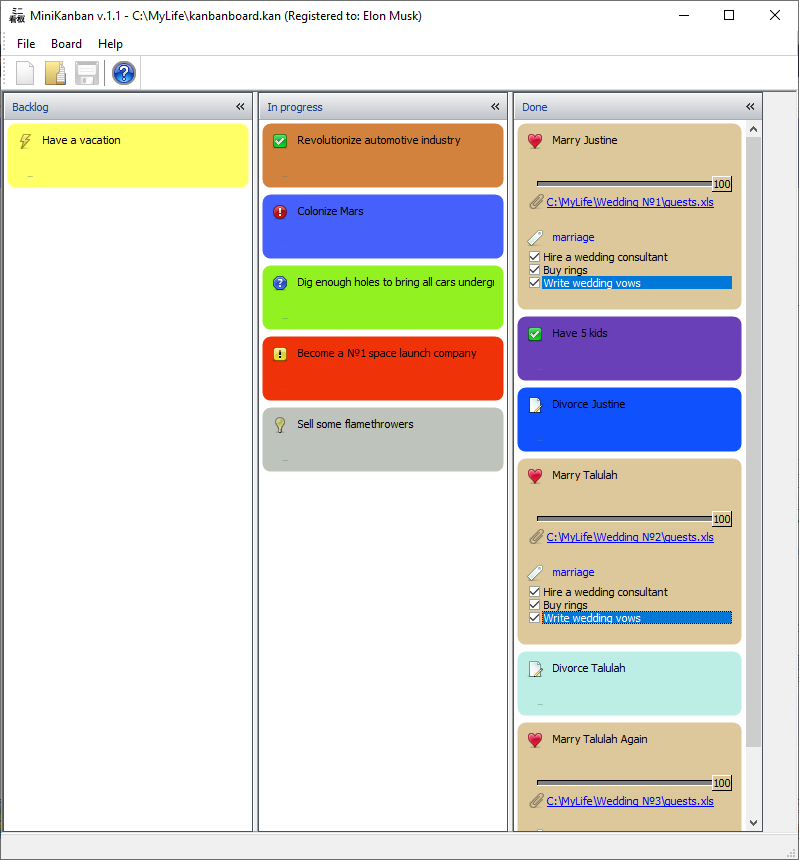

==========
Tutorial
==========

This tutorial will show you how to create a simple help file for your application using Helpinator Help Authoring Tool. It covers basic steps without drilling deep into advanced features, so you will get a clear understanding of what Helpinator is about without unnecessary information.

In this tutorial we'll create a help file for another our product called " `MiniKanban <https://www.minikanban.com>`_": 

MiniKanban tool

