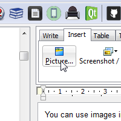
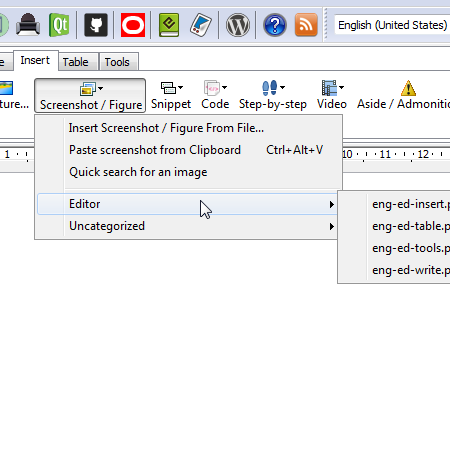
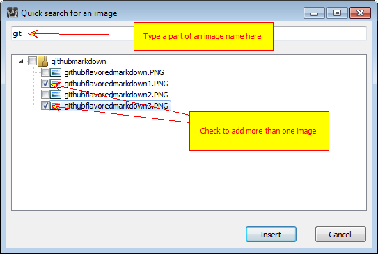

==============
Using Images
==============

You can use images in one of the following ways:

1. Inside topics or other textual content pieces.
2. In step-by-step guides.

Step-by-step guides have their own topic, here we'll talk about inserting images into topics.

You are not forced to use Image Library, you can add images into topics as in usual text processor, using the toolbar button shown below.

Insert inline picture

Inserting library images is not very different from it. Click on a toolbar button and select an image from the drop-down list. Note that images are grouped by category.

Insert Screenshot / Figure

Now when you change an image in the image library it is automatically updated in all topics that reference it.

There are other options available:

1. **"Insert Screenshot / Figure From File..."** - use it if you have an image on your hard drive and want to insert in the position of caret and into the project library at the same time.
2. **"Paste screenshot from Clipboard"** - use it if the image is in clipboard, obtained by Ctrl-PrtScr or other screenshot capture tool.
3. **"Quick search for an image"** - allows you to quickly locate image in the project library by it's name. How it works:

Quick search for an image

Type a part of image name into the edit box at the top of the window and it will filter out images that do not match the criteria. Now you can select one or more images with checkboxes and click "Insert" to place them in the position of caret.
