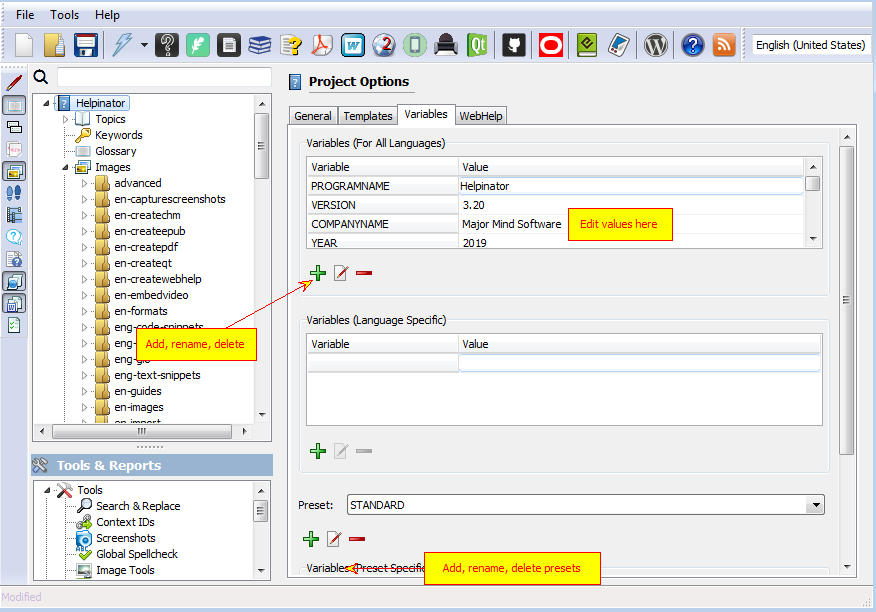

===========
Variables
===========

Variables play important part in Helpinator project:

1. They contain info that changes frequently, like version number.
2. They are used in templates to insert product name, version, edition and etc, so you don't need to alter templates for that kind of stuff.
3. They help to control conditional compilation. You can get two different help files from the same source changing one or more variables before compilation.

All variables are located on the "Variables" tab of Project Options.

Variables

"Presets" are the easy way to switch sets of variable values and are especially useful in conditional compilation.

In the example above variable "EDITION" has the value "STD" in the preset named "STANDARD" and "PRO" in the preset named "PROFESSIONAL". Select active preset before compilation to set variable values.
