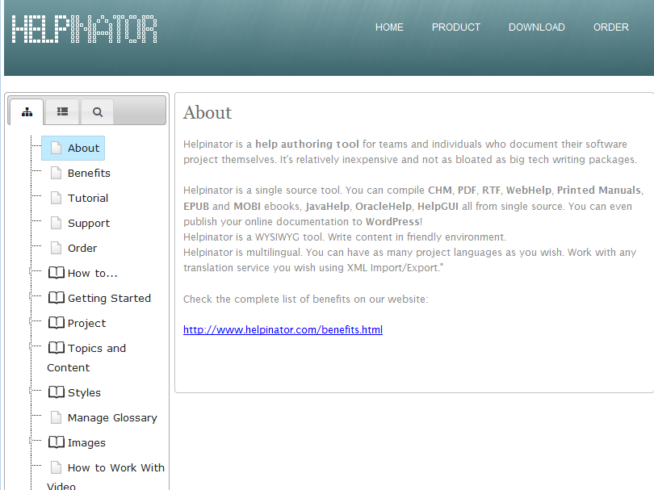
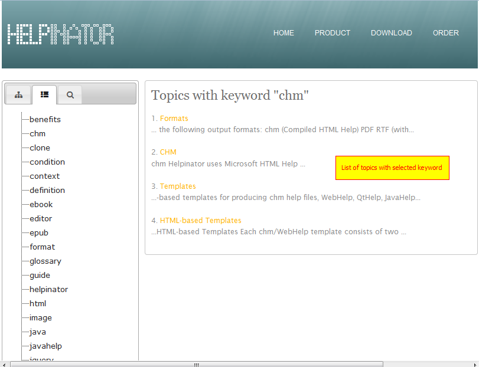
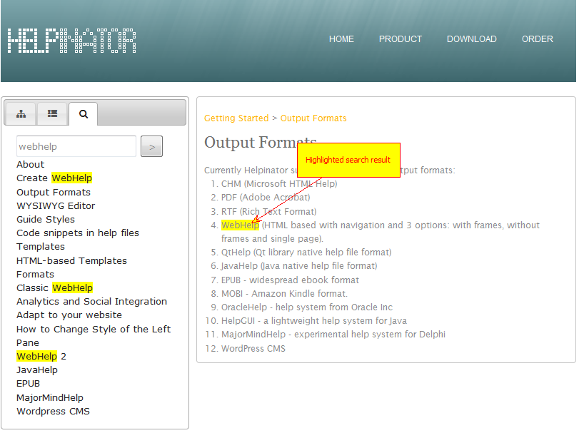

=================
Classic WebHelp
=================

WebHelp is a set of javascript-powered HTML pages with table of contents, index and search feature. Helpinator uses the same HTML template to compile topic pages that it uses to compile CHM, except it publishes JQuery UI theme from jqueryui.zip file.

WebHelp - topic

WebHelp - index

WebHelp - search

