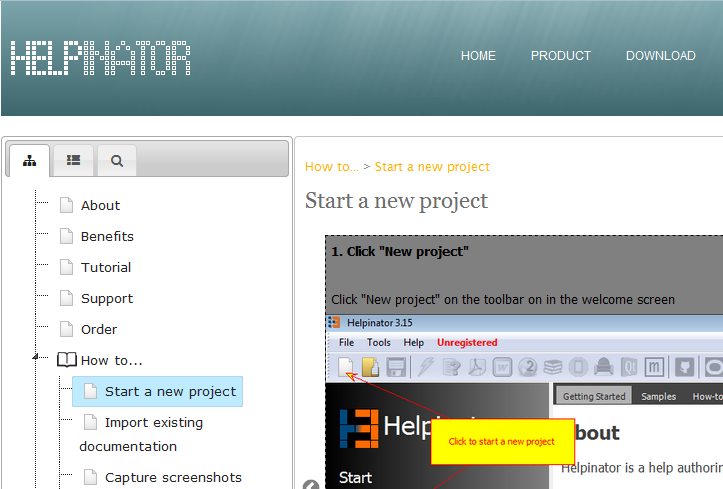

===========
WebHelp 2
===========

WebHelp 2 is a major overhaul of Classic WebHelp with the following aims:

1. Avoid usage of frames that are obsolete in HTML by now. 
2. Make it responsive.
3. Make it more SEO-friendly.

General structure of WebHelp2 matches that of Classic WebHelp, with "Table Of Contents"-"Index"-"Search" block on the left side, content block on the right plus customizable header and footer. But there are some differences as well:

1. Step-by-step guides now use different engine that is modern and responsive.
2. Code snippets highlighter is different too.
3. Images scale automatically when window size changes.
4. Web browser remembers last selected tab and width of the left sidebar.
5. Folder structure is now more neat with "js" subfolder for JavaScript, all images in "images" folder and the main folder containing only html files.

Helpinator's online documentation now uses new WebHelp 2:  `http://www.helpinator.com/help/about.html <http://www.helpinator.com/help/about.html>`_

It looks like this:

WebHelp2

