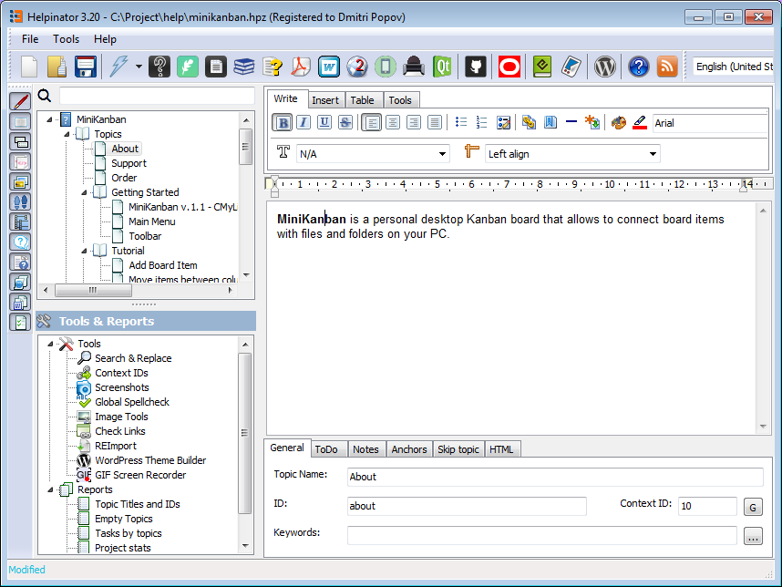
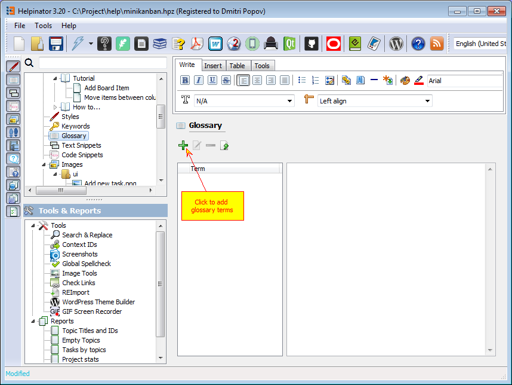
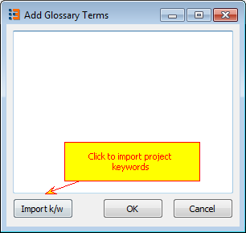
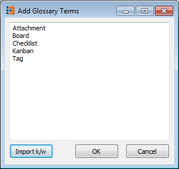
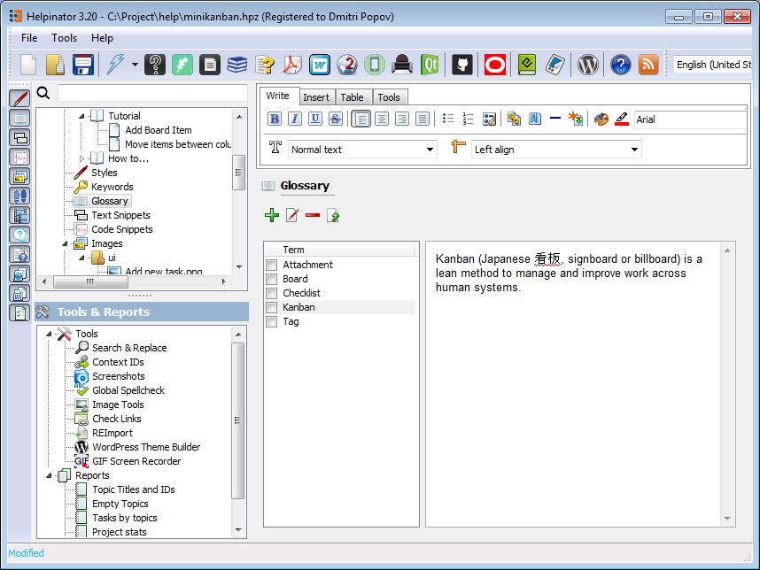
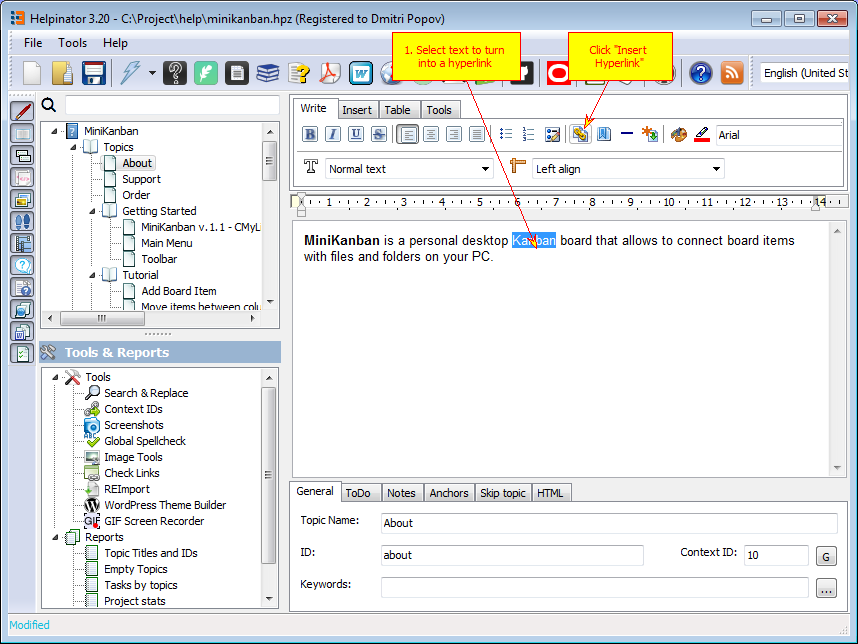
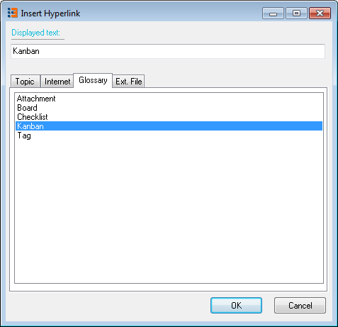
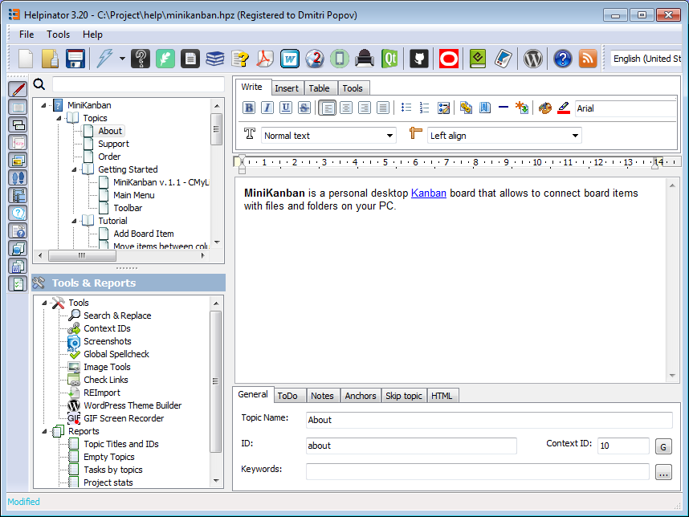
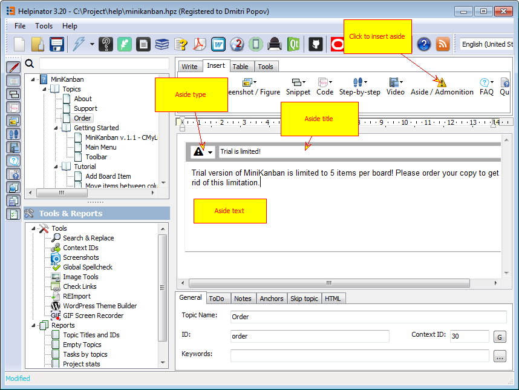

================
Writing topics
================

Now let's write some introductory text. 

Topic editor.

Suppose our users live in a perfect world of sunshine and rainbows and never knew anything about satan. We need to explain this term. And again Helpinator is here to save you, it has built-in Glossary manager. 

Glossary

In the "Add Glossary Terms" dialog click on "Import k/w", this will import project's keywords into glossary. 

Add glossary terms.

Now you can write definitions for the terms added. 

Write glossary term definition.

Let's go back to the topic editor and create a hyperlink for the glossary term. 

Inerting a hyperlink

In the "Insert hyperlink" dialog select the term to link to. 

Insert hyperlink.

After hyperlink was inserted

Return to the topic editor. Now let's insert a "Warning" aside using the toolbar button. Later we will see how it will be rendered in the output. 

Insert aside

