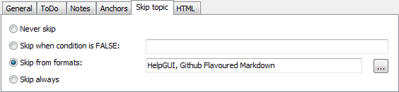

================================
Classic Toolbar WYSIWYG Editor
================================

Text authoring UI of Helpinator is similar to any other text processor. It has common text formatting toolbars, as well as Helpinator-specific object insertion commands, like "insert code snippet" and other. It also allows you to apply named text and paragraph styles to  selected text.

Images below show what each toolbar button is for:

Below editor area there's topic settings tab set:

Click "..." to open "Topic keywords" dialog. It allows to select from keywords already existing in the project, added new keywords manually or using a list of suggested keywords.

"ToDo" tab contains simple todo list of tasks assigned to this topic. Later on you can review all tasks assigned to all topics in global tasks manager ("Tasks" node of the project tree view) or using the report "Tasks by topic" that shows a list of tasks grouped by topic.

.. image:: images/eng-ed-todo.png

Notes allows you to write down something related to this topic. This combined with "COMMENT" tag makes a good tool for text reviews.

Sometimes you need different HTML template for a topic (for example, default, title topic, with big company logo). You can select what template to use - default or maybe special template.

Anchors allow you to reference certain place in this topic, either using a hyperlink or context-sensitive help call using "Context ID".

"Skip topic" tab allows you to skip current topic from output based on:

1. Condition - using variables. See "Conditional compilation" for more details.

2. Skip from certain formats. For example, when topic contains video, it should be exported to CHM and WebHelp, but not PDF and RTF.

3. Skip always - select this mode if this topic is not ready yet.

